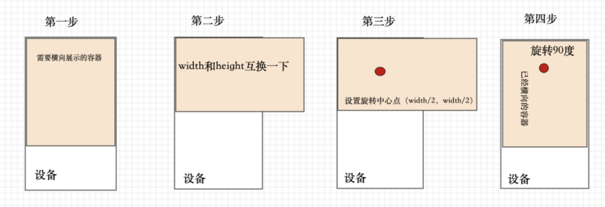

### 仿照 [掘金文章](https://juejin.im/post/5eb766296fb9a0432f0ff8c7)打造一个vue_h5模版

### TODO

- [x] vue-cli4脚手架
- [x] vant按需引入
- [x] 移动端rem适配
- [x] axios拦截封装
- [x] 请求时的加载动画
- [x] vue-router配置
- [x] 登录权限校验
- [x]  多环境变量配置
- [x]  vue.config.js配置
- [x]  toast组件封装
- [x]  dialog组件封装
- [x]  跨域代理设置
- [x]  webpack打包可视化分析
- [x]  gzip打包优化
- [x]  首页添加骨架屏 vue-skeleton-webpack-plugin
- [x]  横屏适配


### tips

1、 postcss-px2rem需要安装到生成环境，不然vant无法适配

2、 vue.config.js的publicPath
> 可以被设置为空字符串 ('') 或是相对路径 ('./')，这样所有的资源都会被链接为相对路径，这样打出来的包可以被部署在任意路径，也可以用在类似 Cordova hybrid 应用的文件系统中

> 相对路径的 publicPath 有一些使用上的限制。在以下情况下，应当避免使用相对 publicPath:
1、 当使用基于 HTML5 history.pushState 的路由时；
2、 当使用 pages 选项构建多页面应用时。


3、骨架屏尝试了一下page-skeleton-webpack-plugin，结果坑太多，不想去研究了，大概看了一下vue-skeleton-webpack-plugin，了解如何使用

### 横屏适配

因为某些业务需求，需要在竖屏的情况下，将内容横屏展示


```js
var width = document.documentElement.clientWidth
      var height = document.documentElement.clientHeight
      var wrapper = document.getElementById('wrap')
      var style = ''
      if (width >= height) { // 竖屏
        style += 'width:100%'
        style += 'height:100%;'
        style += '-webkit-transform: rotate(0); transform: rotate(0);'
        style += '-webkit-transform-origin: 0 0;'
        style += 'transform-origin: 0 0;'
      } else { // 横屏
        style += 'width:' + height + 'px;'// 注意旋转后的宽高切换
        style += 'height:' + width + 'px;'
        style += '-webkit-transform: rotate(90deg); transform: rotate(90deg);'
        // 注意旋转中点的处理
        style += '-webkit-transform-origin: ' + width / 2 + 'px ' + width / 2 + 'px;'
        style += 'transform-origin: ' + width / 2 + 'px ' + width / 2 + 'px;'
      }
      wrapper.style.cssText = style

```